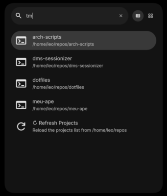

# DMS Sessionizer



A DankMaterialShell launcher plugin that creates tmux sessions for your projects from anywhere inside your workspaces. Quickly open any project directory in a terminal with a dedicated tmux session named after the project/directory.

Inspired by Primeagen's tmux-sessionizer and tonybanters's dmenu-scripts.

## Features

- **Quick Project Access** - Browse all subdirectories in your projects directories from the launcher
- **Multiple Directories** - Search across multiple project directories at once
- **Automatic Tmux Sessions** - Creates a new tmux session named after the selected project
- **Smart Session Handling** - Attaches to existing sessions instead of creating duplicates
- **Multiple Terminal Support** - Works with st, alacritty, kitty, wezterm, foot, konsole, gnome-terminal, xterm, ghostty, or any custom terminal
- **Configurable Projects Directory** - Set any directory as your projects roots (default: `~/projects`)
- **Flexible Terminal Behavior** - Open new windows, kill existing terminals, or reuse existing tmux sessions
- **Fuzzy Search** - Filter projects by typing any part of the name or path

## Installation

### From Plugin Registry (Recommended)

#### Via DMS Settings UI

1. Open DMS Settings
2. Go to the **Plugins** tab
3. Click the **Browse** button
4. Search for "DMS Sessionizer" and click **Install**
5. Restart your DMS session

#### Via dms CLI

```bash
# Install the plugin
dms plugins install dmsSessionizer

# Restart DMS to load the plugin
dms restart
```

Visit [danklinux.com/plugins](https://danklinux.com/plugins) for the full plugin registry.

### Manual Installation

```bash
# Clone the plugin repo to DMS plugins directory
git clone https://github.com/leonardofranco01/dms-sessionizer ~/.config/DankMaterialShell/plugins/dms-sessionizer

# Enable in DMS
# 1. Open Settings
# 2. Go to Plugins tab
# 3. Click "Scan for Plugins"
# 4. Toggle "DMS Sessionizer" to enable

# Note: when using this method you'll also have to update the plugin manually.
```

## Usage

### Default Trigger Mode

1. Open launcher
2. Type `tm` to activate the plugin
3. Browse or search your projects
4. Press Enter to open the selected project in a terminal with tmux

### Examples

- `tm` - Show all projects
- `tm myapp` - Filter projects containing "myapp"
- `tm react` - Find projects with "react" in the name
- `tm work/client` - Search by path segments

### What Happens When You Select a Project

1. Plugin checks if a tmux session with that name already exists
2. If session exists → attaches to it
3. If session doesn't exist → creates new session with:
    - Session name = subdirectory name
    - Working directory = project path
4. Opens your configured terminal with the tmux session

## Configuration

Access settings via DMS Settings → Plugins → DMS Sessionizer:

### Projects Directories

- **Directory Paths**: Paths to your projects directory, separated by commas
    - Supports absolute paths: `/home/user/code`
    - Supports `~` expansion: `~/projects`
    - Supports relative to home: `repos` → `~/repos`
    - Multiple directories: `~/projects, ~/work, ~/code`
    - Default: `~/projects`
- **Include Hidden Directories**: When enabled, includes directories that start with a dot (e.g., `.config`, `.local`)
- **Include Symlinked Directories**: When enabled, follows symbolic links and includes symlinked directories

### Terminal Settings

- **Terminal Emulator**: Choose from popular terminals:
    - st, alacritty, kitty, wezterm, foot, konsole, gnome-terminal, xterm, ghostty
    - Or select "Custom" for any other terminal
- **Custom Terminal** (when Custom selected): Command or path to your terminal executable
- **Terminal Behavior**: Controls how terminal windows are handled when opening sessions:
    - **newWindow** (default): Opens a new terminal window for each session
    - **killExisting**: Kills any running instance of the terminal before launching a new session (useful for single-terminal workflows)
    - **reuseSession**: Switches an existing tmux client to the new session without opening a new terminal. Falls back to opening a new window if no tmux client exists

### Trigger Settings

- **Always Active**: When enabled, projects always show in the launcher without needing a trigger
- **Trigger**: The keyword to activate the plugin (default: `tm`)
    - Examples: `tm`, `t`, `tmux`

### Display Settings

- **Max Results**: Maximum number of projects to display (10-200)

## Requirements

- DankMaterialShell >= 1.2.0 (not tested on older versions)
- Tmux
- A terminal emulator (st, alacritty, kitty, etc.)

## Compatibility

- **Compositors**: Hyprland (not tested on other compositors)
- **Distros**: Universal

## How It Works

The plugin:

1. Scans the configured projects directories for subdirectories
2. Displays them in the launcher with fuzzy search
3. On selection, runs: `tmux new-session -As <project-name> -c <project-path>`
4. The `-A` flag makes tmux attach if session exists, or create if it doesn't

## Troubleshooting

### No projects showing

- Verify your projects directories exist and contain subdirectories
- Check the directory paths in settings (try absolute paths)
- Use the "↻ Refresh Projects" option in the launcher

### Terminal not launching

- Ensure your terminal emulator is installed and in PATH
- Try running the terminal from command line to verify it works
- For custom terminals, provide the full path if needed

### Tmux session not created

- Verify tmux is installed: `which tmux`
- Check if tmux is running: `tmux list-sessions`
- Try creating a session manually: `tmux new-session -s test`

### Settings not applying

- Restart DMS after changing settings

## Contributing

Found a bug or want to add a feature? Open an issue or submit a pull request at [GitHub](https://github.com/leonardofranco01/dms-sessionizer)!

## Credits

### Inspired by

- [ThePrimeagen/tmux-sessionizer](https://github.com/ThePrimeagen/tmux-sessionizer) - The original tmux-sessionizer script for quickly switching between projects
- [tonybanters/dmenu-scripts](https://github.com/tonybanters/dmenu-scripts) - Tmux session management with dmenu/rofi
- [sr-tream/dms-vscode-launcher](https://github.com/sr-tream/dms-vscode-launcher) - A DMS launcher plugin that provides quick access to VS Code projects, directories, and more.

## License

MIT License - See LICENSE file for details
